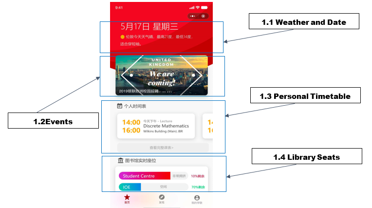

# UCLCSSA WeChat App Functional Specification

## 1. Terminology

This specification uses the terms **MUST, SHOULD, MAY, MUST NOT, MAY NOT, SHOULD
NOT, RECOMMENDED, OPTIONAL** as defined in [RFC2119](https://tools.ietf.org/html/rfc2119).

We use the following terminology to specify the user states:

| Terminology        | Definition                                                                                                        |
| ------------------ | ----------------------------------------------------------------------------------------------------------------- |
| **UCL**            | University College London.                                                                                        |
| **WECHAT LOGIN**   | User is logged in via WeChat API.                                                                                 |
| **UCL LOGIN**      | User is logged in via UCL API.                                                                                    |
| **GUEST**          | User is neither logged in via WeChat nor UCL API.                                                                 |
| **LOCAL TIMEZONE** | The timezone where UCL is located. Note the the timezone needs to take into account Daylight Savings adjustments. |
| **LOCAL CITY**     | London.                                                                                                           |
| **CSSA**           | UCL Chinese Students and Scholars Association.                                                                    |
| **Admin**          | Administrator                                                                                                     |

## 2. Functional Requirements

### 2.1 Main Page

#### 2.1.1 Weather and Date

This part should contain two parts Date and the Weather. We use LOCAL TIMEZONE and LOCAL CITY.

##### 2.1.1.1 Weather Description

Required elements:

- Weather
- Highest Temperature (Degrees Celsius)
- Lowest Temperature (Degrees Celsius)
- Recommended clothing

### 2.2 Events

Events are displayed inside a *horizontal slider*:

- Auto-scroll is enabled on the slider, with animation time set to 2 seconds.

#### 2.2.1 Content

- Events cards MUST contain CSSA activities.
- MAY contain other information.

#### 2.2.2 Horizontal Slider

- Horizontal Slider SHOULD display preview images.
- Each preview image represents an article.

#### 2.2.3 When User tap picture on the horizontal slider

Full news article SHOULD be displayed on a new page.

### 2.3 Personal Timetable

> TODO: What happens if the user is not yet logged in?

The personal time table contains two components:

1. Horizontal slider which displays today's lecture(s).
2. *Show Full Timetable* button ("显示完整课表").

Each lecture is displayed inside a *block* which represents a time slot (c.f.
outlook calendar events).

It is REQUIRED that the horizontal slider only moves when the user scrolls it.

#### 2.3.1 Block

Each block SHOULD include following information:

1. Start and End Times.
2. Event Location(s) (Building, Room).
3. Relevant Participant Name(s) (Lecturer's name in case of a Lecture event).
4. Event Type, one of:
   1. Lecture 
   2. Problem-based Learning
   3. Discussion
   4. Tutorial
   5. Exam (Dependent on UCL API Functionalities)

> TODO: Does UCL Timetable include exam timetables?   

#### 2.3.2 Button

> TODO: Pending design.

### 2.4 Library Seats

- A block that displays available seats for each library.
- The information for each library MUST be displayed as *progress bars*.

#### 2.4.1 Progress bar

- A *progress bar* represents the number of empty seats.
  - When there are no seats:
    - Progress bar is empty.
  - When there are available seats:
    - Progress bar shows proportion of available seats versus total seats.
  - The color of the bar represents how busy each library is.
  - The actual number of available seats MUST be displayed next to the bar.
  - The user MAY press each progress bar if he/she wants to see more information
   about the corresponding library.

#### 2.4.2 Color

The color of the progress bar MUST indicate the availability of each library:

| Color                         | Meaning                                             |
| ----------------------------- | --------------------------------------------------- |
| GREEN :green_heart:           | Proportion of empty seats is above or equal to 70%. |
| YELLOW :yellow_heart:         | Proportion of empty seats is less than 50%.         |
| ORANGE :large_orange_diamond: | Proportion of empty seats is less than 30%.         |
| RED :red_circle:              | Proportion of empty seats is less than 15%.         |

#### 2.4.3 Number Display

- The proportion of available seats and the number of available seats MUST be
displayed.

#### 2.4.4 Library Displayed

The most popular libraries or study facilities that MUST be displayed:

- Main library
- Science library
- Student Centre
- IOE library

The user SHOULD be able to choose his/her favorite study facility (i.e. pin it).

#### 2.4.5 Tapping progress bar

Jump to library seats page.

> TODO: Jump to library seats page.
> TODO: Pending Design.

